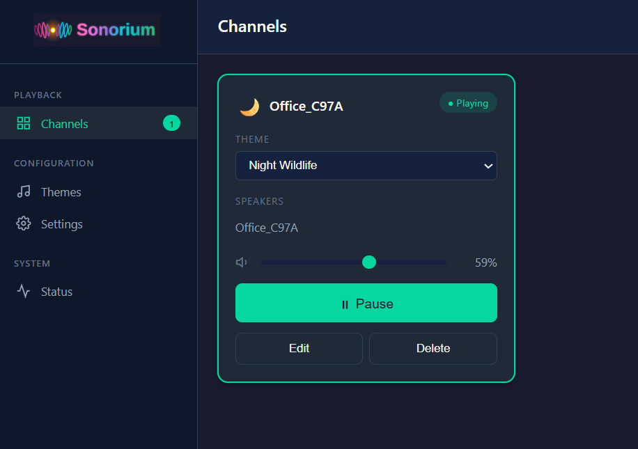
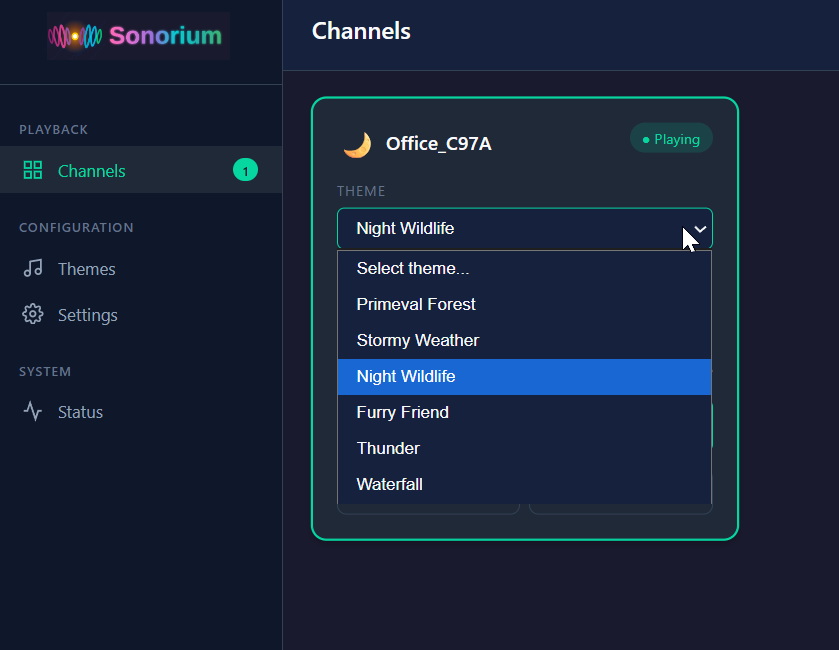
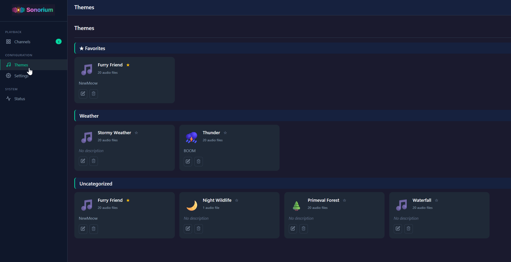
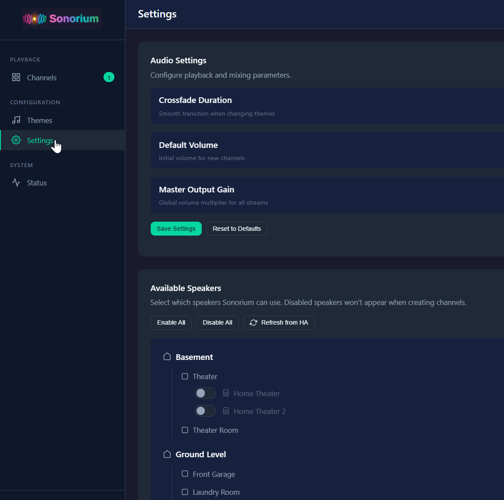

# Sonorium

**Multi-Zone Ambient Soundscape Mixer**

Sonorium lets you create immersive ambient audio environments. Stream richly layered soundscapes—from distant thunder and rainfall to forest ambiance and ocean waves—to speakers throughout your home or directly through your computer.

## Two Ways to Use Sonorium

### Standalone Windows App

Download and run without any dependencies. Perfect for desktop ambient sound.

**[Download Latest Release](https://github.com/synssins/sonorium/releases)** | **[Installation Guide](https://github.com/synssins/sonorium/wiki/Standalone-App)**

- Single portable executable—no installation required
- Local audio playback through your default speakers
- Stream to DLNA network speakers
- Automatic updates built-in

### Home Assistant Addon

Integrate with your smart home for whole-house audio.

- One-click install from addon store
- Use any Home Assistant media_player
- Organize speakers by room, floor, or area
- Control from the HA dashboard

## Screenshots

### Channels View
Create and manage multiple audio channels, each streaming to different speakers.

### Theme Selection
Choose from your library of ambient themes for each channel.

### Themes Library
Organize your audio files into themes with favorites and categories.

### Settings
Configure speakers, volume defaults, and other preferences.

## Features

### Multi-Zone Audio
- **Multiple Channels**: Run up to 6 independent audio channels simultaneously
- **Per-Channel Themes**: Each channel plays its own theme
- **Flexible Speaker Selection**: Target individual speakers, entire rooms, floors, or custom speaker groups
- **Live Speaker Management**: Add or remove speakers from active channels without interrupting playback

### Theme System
- **Theme-Based Organization**: Audio files organized into theme folders (Thunder, Forest, Ocean, etc.)
- **Automatic Mixing**: All recordings in a theme blend together seamlessly
- **Theme Favorites**: Star your most-used themes for quick access
- **Custom Categories**: Organize themes into categories like "Weather", "Nature", "Urban"
- **Theme Icons**: Visual icons for easy theme identification
- **Bundled Themes**: Includes Sleigh Ride, Tavern, and "A Rainy Day... Or is it?" out of the box

### Track Mixer
Fine-tune how each audio file plays within a theme:

- **Presence Control** - Set how often each track appears in the mix (0-100%)
- **Per-Track Volume** - Adjust amplitude independent of presence
- **Playback Modes**:
  - **Auto** - Automatically selects best mode based on file length
  - **Continuous** - Loop with seamless crossfade
  - **Sparse** - Play once, wait before repeating (for short sounds)
  - **Presence** - Fade in/out based on presence setting

### Presets
- **Save/Load Presets** - Store track settings as named presets
- **Quick Switching** - Select presets directly on channel cards
- **Import/Export** - Share presets with the community

### Modern Web Interface
- **Responsive Design**: Works on desktop and mobile
- **Dark Theme**: Easy on the eyes
- **Real-Time Status**: See what's playing across all channels
- **Drag & Drop**: Upload audio files directly through the UI

## Why Ambient Sound?

Ambient soundscapes aren't just background noise—they're a powerful tool for mental wellness and productivity:

- **ADHD & Focus**: Background noise can improve concentration by providing consistent auditory input
- **Misophonia**: Ambient masking helps cover trigger sounds
- **Anxiety & Stress**: Nature sounds activate the parasympathetic nervous system
- **Sleep**: Consistent ambient sound masks disruptive noises
- **Work & Study**: Moderate ambient noise can boost creative thinking

## Quick Start

### Standalone App

1. **Download** `Sonorium.exe` from the [Releases page](https://github.com/synssins/sonorium/releases)
2. **Run** the executable (click "More info" → "Run anyway" if Windows SmartScreen appears)
3. **Create** a session, select a theme and speakers
4. **Play** and enjoy your ambient soundscape

### Home Assistant Addon

1. **Install** the addon using the button above
2. **Open Sonorium** from your Home Assistant sidebar
3. **Add Themes**: Create themes and upload audio via the web interface
4. **Create a Channel**: Select a theme and speakers
5. **Play**: Hit the play button

## Documentation

Full documentation is available in the **[Wiki](https://github.com/synssins/sonorium/wiki)**:

- [Getting Started](https://github.com/synssins/sonorium/wiki/Getting-Started) - Home Assistant installation
- [Standalone App](https://github.com/synssins/sonorium/wiki/Standalone-App) - Windows app guide with architecture details
- [Themes](https://github.com/synssins/sonorium/wiki/Themes) - Creating and organizing themes
- [Track Settings](https://github.com/synssins/sonorium/wiki/Track-Settings) - Playback modes explained
- [Presets](https://github.com/synssins/sonorium/wiki/Presets) - Saving track configurations
- [Speakers](https://github.com/synssins/sonorium/wiki/Speakers) - Speaker setup and management
- [API Reference](https://github.com/synssins/sonorium/wiki/API-Reference) - REST API for automation
- [Troubleshooting](https://github.com/synssins/sonorium/wiki/Troubleshooting) - Common issues

## Supported Formats

Audio files: `.mp3`, `.wav`, `.flac`, `.ogg`

Single-file themes loop seamlessly using crossfade blending—no jarring restarts!

## Supported Speakers

### Standalone App
- Local audio output (default speakers)
- DLNA/UPnP network speakers
- *Coming soon: AirPlay, Sonos, Chromecast*

### Home Assistant Addon
- Any media_player entity in Home Assistant
- Organized by floors, areas, and custom groups

## API Reference

Sonorium provides a REST API for integration:

### Streams
- `GET /stream/{theme_id}` - Direct audio stream for a theme
- `GET /stream/channel{n}` - Audio stream for channel N

### Sessions/Channels
- `GET /api/sessions` - List all sessions
- `POST /api/sessions` - Create a new session
- `POST /api/sessions/{id}/play` - Start playback
- `POST /api/sessions/{id}/stop` - Stop playback
- `POST /api/sessions/{id}/volume` - Set volume

### Themes
- `GET /api/themes` - List all themes
- `POST /api/themes/create` - Create a new theme
- `POST /api/themes/{id}/upload` - Upload audio file

## Acknowledgements

Sonorium is a fork of [Amniotic](https://github.com/fmtr/amniotic) by [fmtr](https://github.com/fmtr). The original project laid the groundwork with its innovative approach to ambient soundscape mixing.

## License

See LICENSE file for details.

## Contributing

Contributions are welcome! Please open an issue to discuss changes before submitting a PR.
